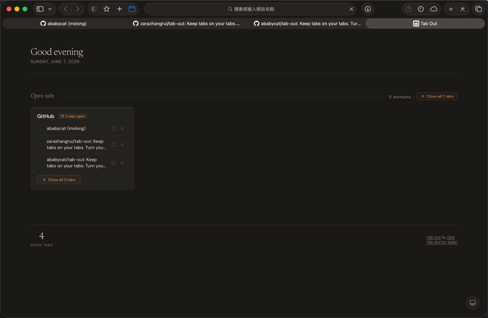

# Tab Out for Safari

This is a Safari fork of the original [Tab Out](https://github.com/zarazhangrui/tab-out) Chrome extension. All the same features — grouped tabs, one-click close, save for later — plus a few extras.

### What's new in this fork

- **Masonry layout** — tab groups are arranged in a compact waterfall layout instead of a fixed grid, making better use of vertical space
- **Dark mode** — full dark theme support with automatic system appearance detection, plus a manual toggle to cycle between auto / light / dark



### Build for Safari

```bash
./build-safari.sh
```

This generates a native Safari extension project in `Tab Out/`. Open it in Xcode, sign it with your Apple Developer team, and run. The script preserves your signing settings between rebuilds.

### Safari differences

- Click the toolbar icon to open the dashboard in a new tab (Safari doesn't support new-tab-page overrides)
- Badge count is disabled to avoid the red number bubble on the toolbar icon
- Toolbar icon appears in the system accent color when active — this is Safari's standard behavior for all extensions

---

# Tab Out

**Keep tabs on your tabs.**

Tab Out is a Chrome extension that replaces your new tab page with a dashboard of everything you have open. Tabs are grouped by domain, with homepages (Gmail, X, LinkedIn, etc.) pulled into their own group. Close tabs with a satisfying swoosh + confetti.

No server. No account. No external API calls. Just a Chrome extension.

---

## Install with a coding agent

Send your coding agent (Claude Code, Codex, etc.) this repo and say **"install this"**:

```
https://github.com/zarazhangrui/tab-out
```

The agent will walk you through it. Takes about 1 minute.

---

## Features

- **See all your tabs at a glance** on a clean grid, grouped by domain
- **Homepages group** pulls Gmail inbox, X home, YouTube, LinkedIn, GitHub homepages into one card
- **Close tabs with style** with swoosh sound + confetti burst
- **Duplicate detection** flags when you have the same page open twice, with one-click cleanup
- **Click any tab to jump to it** across windows, no new tab opened
- **Save for later** bookmark tabs to a checklist before closing them
- **Localhost grouping** shows port numbers next to each tab so you can tell your vibe coding projects apart
- **Expandable groups** show the first 8 tabs with a clickable "+N more"
- **100% local** your data never leaves your machine
- **Pure Chrome extension** no server, no Node.js, no npm, no setup beyond loading the extension

---

## Manual Setup

**1. Clone the repo**

```bash
git clone https://github.com/zarazhangrui/tab-out.git
```

**2. Load the Chrome extension**

1. Open Chrome and go to `chrome://extensions`
2. Enable **Developer mode** (top-right toggle)
3. Click **Load unpacked**
4. Navigate to the `extension/` folder inside the cloned repo and select it

**3. Open a new tab**

You'll see Tab Out.

---

## How it works

```
You open a new tab
  -> Tab Out shows your open tabs grouped by domain
  -> Homepages (Gmail, X, etc.) get their own group at the top
  -> Click any tab title to jump to it
  -> Close groups you're done with (swoosh + confetti)
  -> Save tabs for later before closing them
```

Everything runs inside the Chrome extension. No external server, no API calls, no data sent anywhere. Saved tabs are stored in `chrome.storage.local`.

---

## Tech stack

| What | How |
|------|-----|
| Extension | Chrome Manifest V3 |
| Storage | chrome.storage.local |
| Sound | Web Audio API (synthesized, no files) |
| Animations | CSS transitions + JS confetti particles |

---

## License

MIT

---

Built by [Zara](https://x.com/zarazhangrui)
